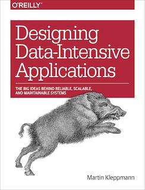

花了两个星期终于看完了。这本书大概是豆瓣上评分最高（9.7分）的 tech book 了。

#### 一句话评价

> Everything you need to know about building a scalable、reliable and maintainable data system.

#### 详细的评价

1. 语言生动，例如作者如何描述一个节点被判定为不可用：

> Imagine a network with an asymmetric fault: a node is able to receive all messages sent to it, but any outgoing messages from that node are dropped or delayed [19]. Even though that node is working perfectly well, and is receiving requests from other nodes, the other nodes cannot hear its responses. After some timeout, the other nodes declare it dead, because they haven’t heard from the node. The situation unfolds like a nightmare: the semi-disconnected node is dragged to the graveyard, kicking and screaming “I’m not dead!”—but since nobody can hear its screaming, the funeral procession continues with stoic determination.

2. 内容范围广泛

从数据格式、存储、数据库引擎的实现到集群、分片，从单机事务到分布式系统的共识算法，从 batch processing 到 stream processing 等等。

3. 提供了不同的看待 data system 的视角

例如：

1. 数据库的 secondary index 对比 materialized view
2. 将 Materialized view 的构建看做是 write path，对其的读或查询看做是 read path，以及 boundary between write path/read path and their cost
3. 将 relational database 看做 schema on write，将 nosql 看做 schema on read

除了技术之外，也探讨了新技术的发展对于现有道德及法规的冲击，关注当下的技术伦理问题，将信息时代与工业革命做了对比：

> Just as the Industrial Revolution had a dark side that needed to be managed, our transition to the information age has major problems that we need to confront and solve. I believe that the collection and use of data is one of those problems. In the words of Bruce Schneier [96]:
>
> 『Data is the pollution problem of the information age, and protecting privacy is the environmental challenge. Almost all computers produce information. It stays around, festering. How we deal with it—how we contain it and how we dispose of it—is central to the health of our information economy. Just as we look back today at the early deca‐ des of the industrial age and wonder how our ancestors could have ignored pollution in their rush to build an industrial world, our grandchildren will look back at us during these early decades of the information age and judge us on how we addressed the chal‐ lenge of data collection and misuse.
We should try to make them proud.』

针对这样一种观点：“互联网公司提供了免费的服务，而用户为了使用这些免费的服务将自己的信息奉上，是一种对等的交易”，作者也一针见血地做出来反驳：

> We might assert that users voluntarily choose to use a service that tracks their activ‐ ity, and they have agreed to the terms of service and privacy policy, so they consent to data collection. We might even claim that users are receiving a valuable service in return for the data they provide, and that the tracking is necessary in order to provide the service. Undoubtedly, social networks, search engines, and various other free online services are valuable to users—but there are problems with this argument.
> 
> Users have little knowledge of what data they are feeding into our databases, or how it is retained and processed—and most privacy policies do more to obscure than to illuminate. Without understanding what happens to their data, users cannot give any meaningful consent. Often, data from one user also says things about other people who are not users of the service and who have not agreed to any terms. The derived datasets that we discussed in this part of the book—in which data from the entire user base may have been combined with behavioral tracking and external data sour‐ ces—are precisely the kinds of data of which users cannot have any meaningful understanding.
>
> Moreover, data is extracted from users through a one-way process, not a relationship with true reciprocity, and not a fair value exchange. There is no dialog, no option for users to negotiate how much data they provide and what service they receive in return: the relationship between the service and the user is very asymmetric and one- sided. The terms are set by the service, not by the user [99].

可以说的上是“又红又专”。